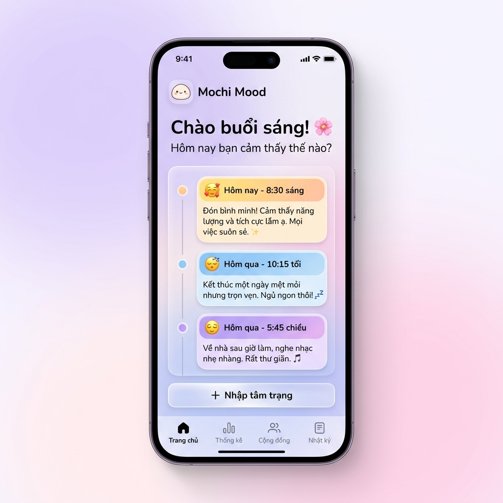
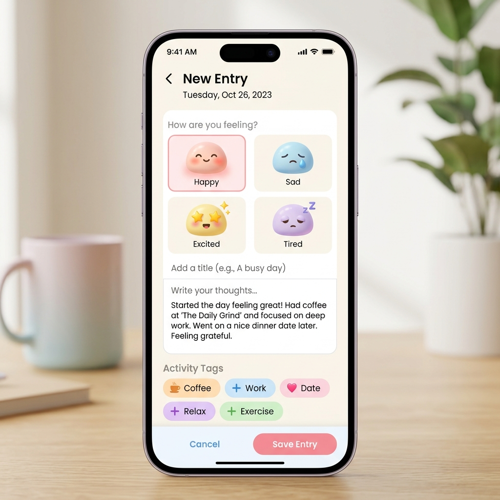
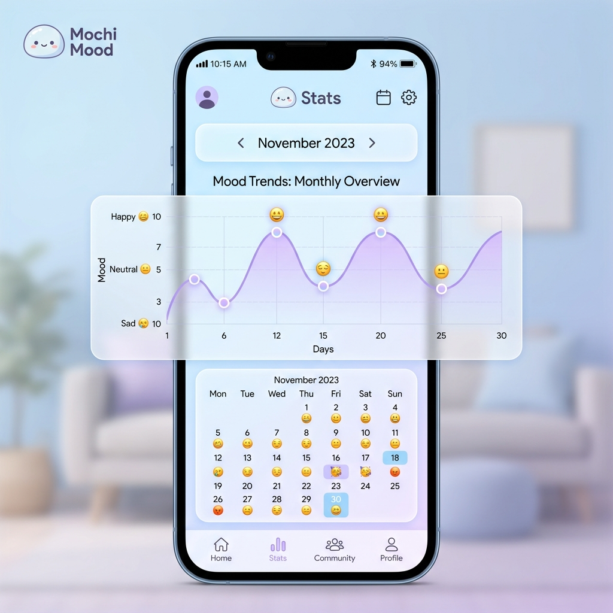

# Mochi Mood ✨ 
### *Nơi cảm xúc được lắng nghe và vỗ về.*

[](https://opensource.org/licenses/MIT)
[](https://developer.mozilla.org/en-US/docs/Web/JavaScript)
[](https://supabase.com/)

---

## 📸 0. Giao diện ứng dụng (Showcase)

<div align="center">
  <table style="border: none;">
    <tr>
      <td align="center">
        <br/>
        <b>Trang chủ & Timeline</b>
      </td>
      <td align="center">
        <br/>
        <b>Viết nhật ký</b>
      </td>
    </tr>
    <tr>
      <td align="center">
        <br/>
        <b>Thống kê cảm xúc</b>
      </td>
      <td align="center">
        <br/>
        <b>Kết nối người thương</b>
      </td>
    </tr>
  </table>
</div>

---
[](https://github.com/Tuannanhdev/mochi-mood)

---

## 📖 1. Giới thiệu dự án
**Mochi Mood** là một ứng dụng Web (Web App) được xây dựng với mục tiêu giúp người dùng theo dõi và quản lý sức khỏe tâm thần hàng ngày. 

### 🎯 Triết lý sản phẩm
Trong một thế giới đầy biến động, chúng ta thường quên mất việc phải tự chăm sóc bản thân. Mochi Mood ra đời để nhắc nhở bạn rằng: **"Mọi cảm xúc của bạn đều đáng quý"**. Ứng dụng tập trung vào sự tối giản, không quảng cáo, không gây áp lực, chỉ có bạn và những dòng tâm sự.

---

## ✨ 2. Các tính năng trọng tâm (Chi tiết)

### 📝 Trải nghiệm ghi chép (Journaling)
- **Hệ thống Mood đa dạng**: Hơn 25 trạng thái cảm xúc từ "Hào hứng", "Bình yên" đến "Mệt mỏi", "Buồn ngủ" được thiết kế với bảng màu Pastel tương ứng.
- **Tích hợp Media**: Hỗ trợ tải lên nhiều hình ảnh cùng lúc, tạo thành một album kỷ niệm nhỏ cho mỗi bài đăng.
- **Hoạt động đi kèm**: Ghi lại lý do đằng sau cảm xúc của bạn qua các thẻ hoạt động (Tag) như: Làm việc, Thể dục, Hẹn hò, Ăn uống...

### 📊 Hệ thống phân tích (Insights)
- **Mood Line Chart**: Biểu đồ đường sử dụng Canvas API để vẽ lại quỹ đạo tâm trạng của bạn trong suốt cả tháng, giúp bạn nhận diện các chu kỳ cảm xúc.
- **Mood Distribution**: Biểu đồ tròn trực quan hóa tỷ lệ phần trăm các loại cảm xúc bạn đã trải qua.
- **Streak Tracker**: Hệ thống tính chuỗi ngày ghi chép liên tục để khuyến khích thói quen viết nhật ký hàng ngày.

### 💞 Kết nối người thương (Partner Connect)
- **Real-time Sync**: Đồng bộ hóa trạng thái cảm xúc với một người dùng khác thông qua mã kết nối duy nhất.
- **Quick React**: Gửi tim hoặc biểu tượng cảm xúc nhanh để động viên đối phương ngay lập tức.
- **Shared Timeline**: Xem dòng thời gian chia sẻ của hai người (nếu được phép).

---

## 🎨 3. Hệ thống thiết kế (Design System)

### 🌈 Bảng màu (Color Palette)
Ứng dụng sử dụng hệ màu Pastel Soft để giảm căng thẳng:
- **Primary (Pastel Pink)**: `#ffb3cc` - Đại diện cho tình yêu và sự quan tâm.
- **Secondary (Pastel Blue)**: `#c8e6f5` - Mang lại cảm giác bình yên, tĩnh lặng.
- **Accent (Lavender)**: `#b583f5` - Điểm nhấn cho các hành động quan trọng (Nút bấm, Timeline).

### 🖋️ Phông chữ (Typography)
- Sử dụng phông chữ **Nunito** (Google Fonts) với các biến thể từ 400 đến 900. Đây là phông chữ không chân (Sans-serif) với các nét bo tròn, tạo cảm giác gần gũi và dễ đọc.

---

## 🛠️ 4. Kiến trúc kỹ thuật (Architecture)

### 📦 Cấu trúc thư mục (File Tree)
```text
mochi-mood/
├── src/
│   ├── modules/
│   │   ├── home.js      # Trang chủ: Quản lý Timeline, Streak, Highlights
│   │   ├── journal.js   # Quản lý danh sách nhật ký, tìm kiếm & bộ lọc
│   │   ├── stats.js     # Thống kê: Lịch, Chart (Line/Pie), Chi tiết ngày
│   │   ├── entry.js     # Viết mới: Xử lý Form, Mood Picker, Activity Tags
│   │   ├── partner.js   # Partner: Kết nối, Real-time Chat/React
│   │   ├── profile.js   # Cá nhân: Avatar Edit, Bio, Settings
│   │   ├── camera.js    # Camera: Chụp ảnh, Album picker
│   │   ├── gallery.js   # Gallery: Lightbox, Photo viewing
│   │   └── onboarding.js# Hướng dẫn người dùng mới (Tour)
│   ├── api.js           # Supabase SDK Integration (CRUD & Realtime)
│   ├── state.js         # Quản lý trạng thái tập trung (Single Source of Truth)
│   ├── config.js        # Global Constants & App Configurations
│   ├── utils.js         # Helper functions (Date format, Toast, Confetti)
│   └── main.js          # Entry Point & DOM Event Listeners
├── style.css            # Toàn bộ CSS (Responsive, Glassmorphism, Animations)
├── index.html           # Single Page Application structure
└── .gitignore           # Các file bỏ qua khi đẩy lên GitHub
```

### 🗄️ Cơ sở dữ liệu (Supabase Schema)
- **Users**: `id, name, avatar_emoji, avatar_img, bio, partner_id, badges`
- **Mood_Entries**: `id, user_id, date, time, mood, text, imgs, activities, shared`
- **Custom_Events**: `id, user_id, title, icon, date, repeat_type`

---

## 🚀 5. Hướng dẫn cài đặt & Triển khai

### Chạy tại địa phương (Local)
1. **Clone Repo**:
   ```bash
   git clone https://github.com/Tuannanhdev/mochi-mood.git
   ```
2. **Cấu hình API**: 
   Chỉnh sửa file `src/config.js` với URL và Key từ bảng điều khiển Supabase của bạn.
3. **Mở với Live Server**: 
   Sử dụng extension Live Server trong VS Code để khởi chạy file `index.html`.

### Triển khai (Deployment)
Ứng dụng có thể được triển khai dễ dàng lên **Vercel**, **Netlify** hoặc **GitHub Pages** vì đây là một dự án Static Web hoàn toàn.

### 📱 Cài đặt trên Điện thoại (Progressive Web App - PWA)
Mochi Mood hỗ trợ công nghệ PWA đầy đủ, cho phép bạn cài đặt trực tiếp vào màn hình chính của điện thoại để hoạt động như một app native (có icon riêng, mở full-screen và load siêu tốc):

- **Trên iPhone (Trình duyệt Safari):**
  1. Mở Safari, truy cập vào đường link Vercel của bạn.
  2. Bấm nút **Share** (chia sẻ) có hình ô vuông và mũi tên chỉ lên ở thanh công cụ dưới cùng.
  3. Cuộn xuống và chọn **"Add to Home Screen"** (Thêm vào màn hình chính).

- **Trên Android (Trình duyệt Chrome):**
  1. Mở Chrome, truy cập vào đường link Vercel của bạn.
  2. Bấm vào biểu tượng dấu **3 chấm** ở góc trên bên phải.
  3. Chọn **"Install app"** (Cài đặt ứng dụng) hoặc **"Add to Home Screen"** (Thêm vào màn hình chính).

---

## 📈 6. Lịch sử cập nhật (Changelog)

### Version 2.0 (Hiện tại)
- **Refactor**: Chuyển đổi toàn bộ mã nguồn sang ES Modules để dễ bảo trì.
- **UI/UX**: Cập nhật bố cục Timeline Marker mới (Emoji trên trục dọc).
- **Features**: 
  - Thêm chức năng **Chỉnh sửa** và **Xóa** bài đăng tinh gọn.
  - **Loại bỏ chức năng Hũ cảm xúc (Mood Jar)** để tối giản hóa giao diện, giúp ứng dụng nhẹ nhàng và tối ưu hiệu năng hơn.
- **Optimization**: Tối ưu hóa việc tải ảnh và hiển thị nội dung dài.

---

## 🤝 7. Đóng góp & Phát triển
Nếu bạn yêu thích Mochi Mood và muốn giúp nó tốt hơn:
1. Gửi phản hồi về lỗi (Bug Report) qua tab **Issues**.
2. Đề xuất tính năng mới (Feature Request).
3. Đóng góp mã nguồn qua **Pull Request**.

---

## 👤 8. Tác giả & Cảm ơn
- **Nguyễn Tuấn Anh** - *Lập trình viên chính* - [GitHub](https://github.com/Tuannanhdev)
- Cảm ơn đội ngũ **Supabase** vì một Backend-as-a-service tuyệt vời.
- Cảm ơn **Google Fonts** cho phông chữ Nunito chữa lành.

---
*Dự án này được tạo ra với sự yêu thương và mong muốn lan tỏa năng lượng tích cực đến mọi người. 🧁🌸*
